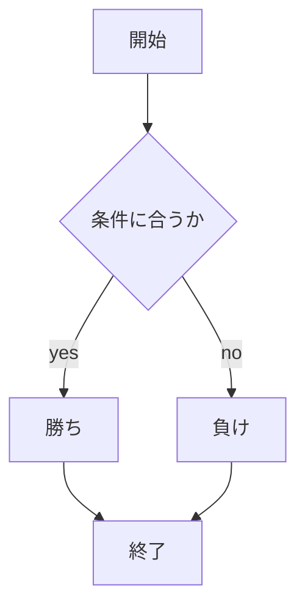
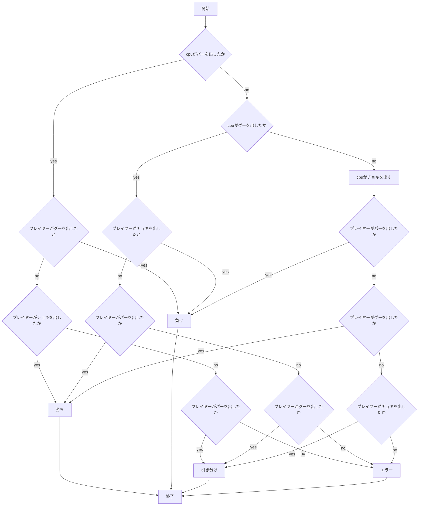
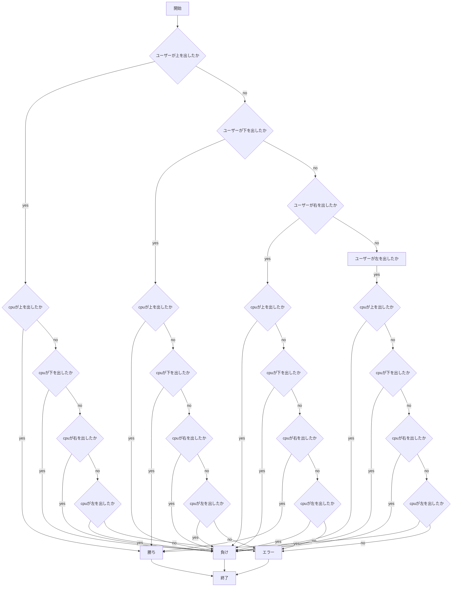
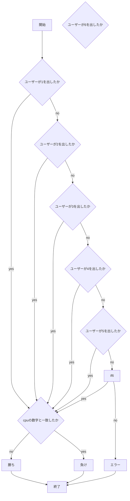
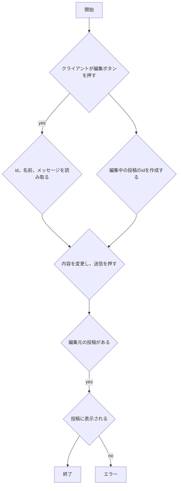
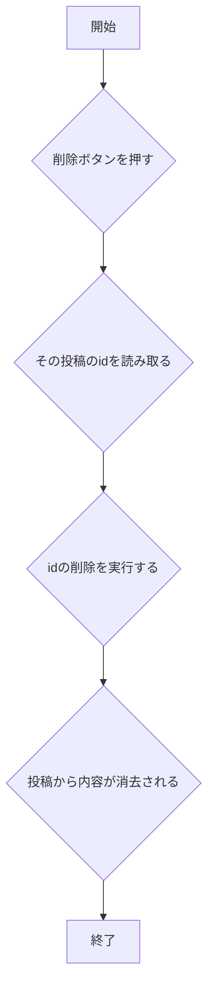

# webpro_06

## このプログラムについて

## ファイル一覧
ファイル名 | 説明
-|-
app5.js | プログラム本体
public/janken.html | じゃんけんの開始画面
views/janken.ejs | じゃんけんの表示設定
```javascript
console.log( 'Hello' );
```



## 使用方法
1. app5.js を起動する
1. Webブラウザでlocalhost:8080/public/janken.htmlにアクセスする
1. 自分の手を入力する

##　課題内容

## 起動方法
1. ターミナルで```webpro_06```まで移動
2. ターミナルで```node app5.js```と入力，実行する
3. ```telnet localhost 8080```とにゅうりょくする
4. ```GET /(表示するファイル名) HTTP/1.1``
改行，さらに```Host: localhost```と入力し，2回改行する．

## 機能

### hello1について
1. ターミナルで```node app5.js```と入力する
2. ブラウザで```localhost:8080/public/show.html```にアクセスする
3. web上に挨拶が表示される

### hello2について
hello1と表示内容は同じ
hello2では，hello1のときに定義していた変数message1，message2を直接greetに入れている

### Iconについて
1. ターミナルで```node app5.js```を起動する
2. ブラウザで```localhost:8080/public/icon.html```にアクセスする
3. アイコンが表示される

### おみくじについて
1. ターミナルで```node app5.js```を起動する
2. ブラウザで```localhost:8080/public/luck.html```にアクセスする
3. ランダムで運勢が表示される

### じゃんけんについて
1. ターミナルで```node app5.js```を起動する
2. ブラウザで```localhost:8080/public/janken.html```にアクセスする
3. グー，チョキ，パーそれぞれの入力に対応してランダムにcpuの手が判定される
4. ユーザーの手とcpuの手から勝敗が判定される
5. 勝敗に応じて，判定，勝利数，試合数が表示される

ファイル名 | 説明
-|-
app5.js | プログラム本体
public/janken.html | じゃんけんの開始画面
views/janken.ejs | じゃんけんの表示設定


### あっち向いてホイについて
1. ターミナルで```node app5.js```を起動する
2. ブラウザで```localhost:8080/public/hoi.html```にアクセスする
3. 上，下，右，左から一つを選択する
4. cpuがランダムで方向を選択して，ユーザーが選んだ方向と同じか判定する
5. 同じなら勝ち，違えば負けとして，判定，勝利数，試合数を表示する

ファイル名 | 説明
-|-
app5.js | プログラム本体
public/hoi.html | あっち向いてホイの開始画面
views/hoi.ejs | あっち向いてホイの表示設定


### 数字が被らないようにするゲームについて
1. ターミナルで```node.app5.js```を起動する
2. ブラウザで```localhost:8080/public/suuji.html```にアクセスする
4. 1~6の数字を入力，実行する
5. cpuの数字がランダムで判定され，ユーザーと同じ場合負け，違う場合勝ちとする．
6. ユーザーの数字，cpuの数字，判定，勝利数，試合数を表示する

ファイル名 | 説明
-|-
app5.js | プログラム本体
public/suuji.html | 数字を一致させないゲームの開始画面
views/suuji.ejs | 数字を一致させないゲームの表示設定




## Gitで管理する方法
1. 適切なディレクトリに移動する
2. ターミナルで```git add .```と入力する
3. コメントを```git commit -am '入力するコメント'```でコメントの部分に入力する
4. ```git push```で更新する

### 掲示板の編集機能について
1. ターミナルで```node.app8.js```を起動する
2. ブラウザでlocalhost:8080/public/bbs.htmlにアクセスする
3. 名前，メッセージを入力し，投稿をチェックする
4. 編集を押し，入力し直す
5. 投稿した内容が変更される



### 掲示板の削除機能について
1. ターミナルで```node.app8.js```を起動する
2. ブラウザでlocalhost:8080/public/bbs.htmlにアクセスする
3. 名前，メッセージを入力し，投稿をチェックする
4. 削除を押すと内容が消去される


### 掲示板の返信機能について
1. ターミナルで```node.app8.js```を起動する
2. ブラウザでlocalhost:8080/public/bbs.htmlにアクセスする
3. 名前，メッセージを入力し，投稿をチェックする
4. 返信を押し，名前，メッセージを入力して送信する
5. 元のメッセージの下に内容が表示される

```mermaid
flowchart TD;

start["開始"]
end1["終了"]
if1{"返信ボタンを押す"}
if2{"元投稿によるidを作成する"}
if3{"名前，メッセージを入力，送信する"}
if4{"返信元の投稿がある"}
if5{"返信を表示する"}
error["エラー"]

start --> if1
if1 --> if2
if2 --> if3
if3 -- if4
if4 -->|yes|if5
if4 -->|no|error
if5 --> end1
```